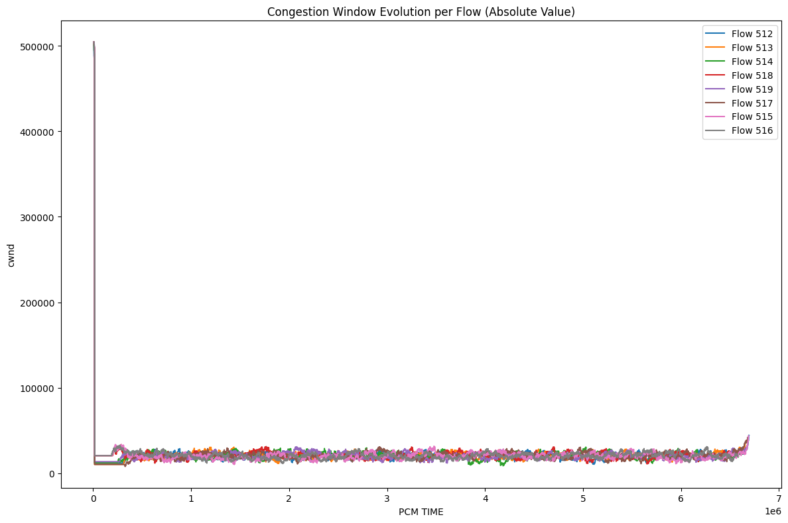

# Programmable Congestion Management (PCM) SDK


## Project structure

- `./include` - contains API definitions of PCM and abstract NIC that supports PCM
- `./src` - contains implementation of the PCM and NIC APIs
- `./algorithms` - contains examples of PCM-based congestion control algorithms: NewReno, DCTCP, DCQCN, Swift, SMaRTT
- `./apps` - contains applications
  - `traffic_gen` - runs N threads (flows), each randomly generating ACKs/NACKs/RTOs/ECNs and served by a chosen CC algo
  - `htsim` - the HTSIM traffic simulation with PCM-based congestion control
- `./analysis` - contains scripts for performance analysis

## Project build

### Basic Build

```bash
# Using Python build script
python3 build.py
```

### HTSIM Build

1. Build patched htsim (execute from the repo **root directory**!):

```bash
git submodule update --init --recursive
cp -r ./uet-htsim-patch/* ./uet-htsim/htsim/sim/
cd ./uet-htsim/htsim/sim/
cmake -S . -B build 
cmake --build build --parallel
```

2. Build PCM runtime from the directory this README placed in:

```bash
./build.py --clean --htsim-dir=$(pwd)/../uet-htsim/htsim/sim/ --relwithdebinfo
```

3. Test build:

```bash
export LD_LIBRARY_PATH=$(pwd)/build/lib/:$LD_LIBRARY_PATH
python3 ./apps/htsim/batch_simulations.py --conf=./apps/htsim/all_algos_incast.json --out=results --plot
```

### Debug Build with Clean

```bash
python3 build.py --debug --clean
```

### Full Development Build

```bash
python3 build.py --debug --hac --profiling --clean
```

### Build Options

| Option                   | Description                   | Default     |
| ------------------------ | ----------------------------- | ----------- |
| `--debug`              | Build in Debug mode           | Release     |
| `--htsim-dir DIR`      | Set HTSIM build directory     | Auto-detect |
| `--profiling`          | Enable profiling support      | OFF         |
| `--hac`                | Enable HAC LLVM optimizations | OFF         |
| `--clean`              | Clean build directory first   | false       |
| `--install`            | Install after building        | false       |
| `--build-dir DIR`      | Custom build directory        | ./build     |
| `--jobs N` or `-j N` | Parallel build jobs           | CPU count   |

### Manual CMake Usage

```bash
mkdir build && cd build

# Basic build
cmake ..

# With all features enabled
cmake -DCMAKE_BUILD_TYPE=Debug \
      -DBUILD_HTSIM_PLUGIN=ON \
      -DHTSIM_BUILD_DIR=/path/to/htsim/sim/ \
      -DBUILD_HAC_PASS=ON \
      -DENABLE_PROFILING=ON ..

# Build with parallel jobs
cmake --build . --parallel $(nproc)

# Install
cmake --install .
```

### Post installation process

1. `export LD_LIBRARY_PATH=$(pwd)/build/lib/:$LD_LIBRARY_PATH`
2. `export PATH=$(pwd)/build/bin/:$PATH`

## Running synthetic application

1. `traffic_gen_app 1 10000000 dctcp &> dctcp.log` runs single flow for 10 seconds (10000000 us) and outputs log into the `dctcp.log` file
2. `python3 ./apps/traffic_gen/cwnd_parser.py dctcp.log cwnd.png` - parse log from the previous step and produces congestion window evolution plot on the screen and into `cwnd.png`:
   

### Algorithm profiling (Linux only)

1. `sudo sysctl -w kernel.perf_event_paranoid=0` - enable collection of perf data without root permissions
2. `analysis/perftest_run.sh $(pwd)/lib/ $(pwd)/perf.out` - collect performance counters for all algorithms:
   - first argument is path to the `.so` libraries of algorithms
   - each algorithm is logged in `$(pwd)/perf.out` directory which is created if doesn't exist
3. `python3 ./analysis/plot_cyc_and_inst.py $(pwd)/perf.out` - generate violin plots for cycles and instructions inside the `$(pwd)/perf.out`

## Running htsim

For now, the supported htsim version is UEC's htsim with patches in `../uec-htsim-patch`.

1. `htsim_flow_app -tm ./apps/htsim/incast_8_1MB.cm -sender_cc_algo nscc -end 30000 -pcm_algorithm smartt &> smartt.log`
2. `python3 apps/htsim/htsim_pcm_cwnd_parser.py smartt.log smartt_cwnd.png`:
   

## Application htsim_atlahs Build & Run Guide

### 1. Clone Repository and Submodules

```bash
cd pcm-sdk

# make sure to pull submodules recursively
git submodule update --init --recursive
```

### 2. Build `uet-htsim`

```bash
# apply uet-htsim-patch to uet-htsim first
cp -r ./uet-htsim-patch/* ./uet-htsim/htsim/sim/

cd ./uet-htsim/htsim/sim
cmake -S . -B build
cmake --build build --parallel
```

### 3. Build `HTSIM_spcl`

```bash
# apply HTSIM_spcl-patch to HTSIM_spcl first
cp -r ./HTSIM_spcl-patch/* ./HTSIM_spcl/htsim/sim

cd ./HTSIM_spcl/htsim/sim
cmake -S . -B build
cmake --build build --parallel
```

### 4. Build PCM

```bash
cd pcm

cmake -S . -B build -DBUILD_HTSIM_PLUGIN=ON
cmake --build build --parallel
```

### 5. Run Applications

#### CM Mode

```bash
cd pcm

python ./apps/htsim_atlahs/batch_simulations_tm.py   --conf ./apps/htsim_atlahs/all_algos_incast.json   --out ./apps/htsim_atlahs/log_tm   --plot
```

#### Goal Mode

```bash
cd pcm

python ./apps/htsim_atlahs/batch_simulations_goal.py   --conf ./apps/htsim_atlahs/pcm_goal_incast_4_nodes.json   --out ./apps/htsim_atlahs/log_goal/4_nodes   --plot

python ./apps/htsim_atlahs/batch_simulations_goal.py   --conf ./apps/htsim_atlahs/pcm_goal_incast_16_nodes.json   --out ./apps/htsim_atlahs/log_goal/16_nodes   --plot
```
