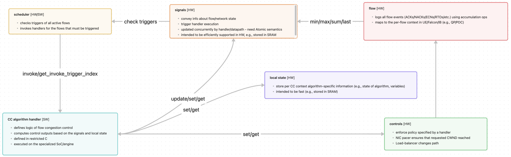

# Programmable Congestion Management (PCM) SDK

## Project structure
- `./include` - contains API definitions of PCM and abstract NIC that supports PCM
- `./src` - contains implementation of the PCM and NIC APIs
- `./algorithms` - contains examples of PCM-based congestion control algorithms: NewReno, DCTCP, DCQCN, Swift, SMaRTT
- `./app` - contains application that runs N synthetic flows served by a given CC algo

## Running synthetic application

1. `make` - compiles whole project into `lib` (app binary) and `bin` folders
    - `CC=gcc make` - change compiler to GCC (default is Clang)
    - `BUILD_HTSIM_FLOW_PLUGIN=1 make` - enable htsim plugin support (disabled by default)
2. `export LD_LIBRARY_PATH=$(pwd):$LD_LIBRARY_PATH`
3. `$./bin/app_main 1 10000000 dctcp $(pwd)/lib/libdctcp.so &> dctcp.log` runs single flow for 10 seconds (10000000 us) and outputs log into the `dctcp.log` file
4. `python3 ./app/parser.py dctcp.log` - parses log from from the previous step and produces congestion window evolution plot on the screen:
